## What is GitHub Actions?
Enables you to create custom software development life cycle (SDLC) workflows directly in our GitHub repository.

- Fully integrated into Github. (Doesn’t require any external site)
- Provides multiple templates for CI and one can create own custom action and publish on the [Marketplace](https://github.com/marketplace?type=actions).
- Completely free for every open-source repository and include 2000 free build minutes per month for all private repositories.

## Common jargon

#### Workflow 
     A configurable automated process to build, test, release, or deploy any project on GitHub. 
#### Runner
     Any machine with the GitHub Actions runner application installed. 
#### Action
     Individual tasks that you combine as steps to create a job.
#### Job
     A set of steps that execute on the same runner. 
#### Step
     A step is an individual task that can run commands or actions.
     
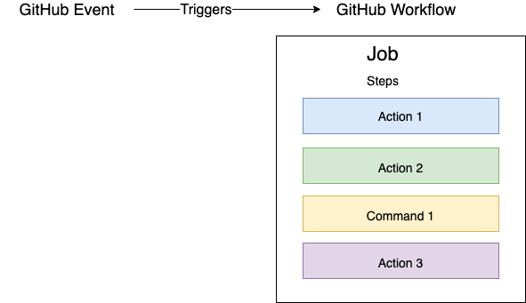

## Creating a workflow file
1. At the root of your repository, create a directory named ` .github/workflows ` to store your workflow files.
2. In ` .github/workflows `, add a `.yml ` or `.yaml ` file for your workflow.
3. Use the "Workflow syntax for GitHub Actions" reference documentation to choose events to trigger an action, add actions, and customize your workflow.

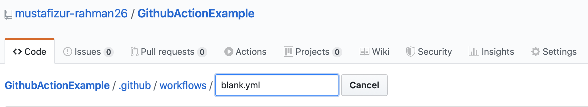

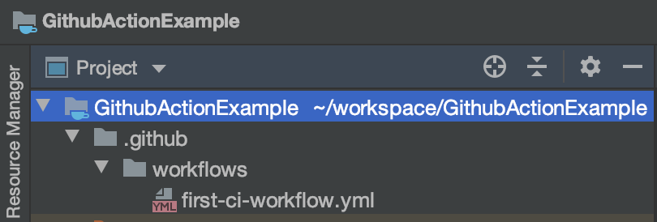

## Workflow file example

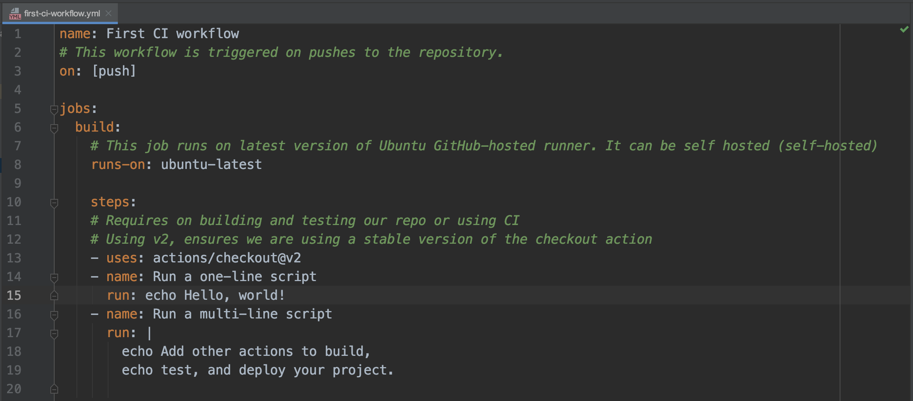

## Triggering a workflow with events
Trigger workflow or every push:

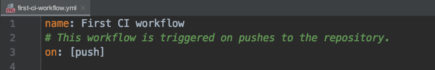
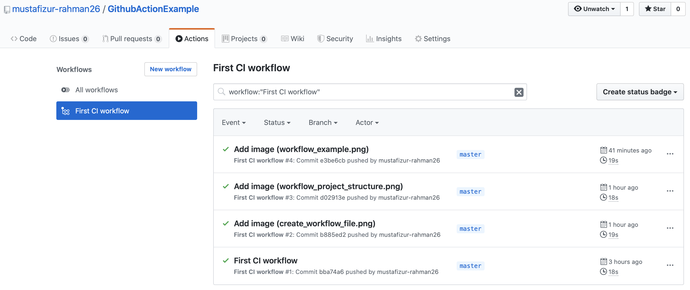

Trigger workflow on every Push that target to master or release branch

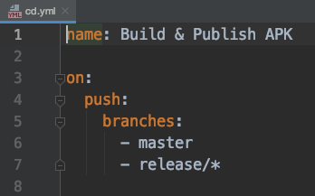

Trigger workflow on every PR that target to master or release branch

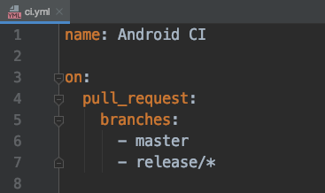

Trigger workflow on every week Monday at 9 o'clock UTC

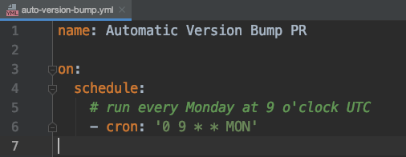

Running workflow

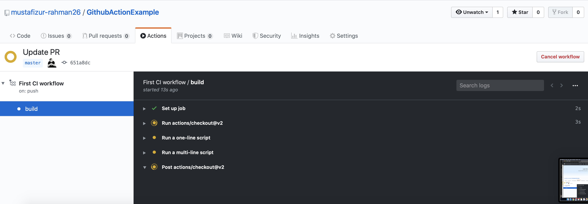

Completed workflow

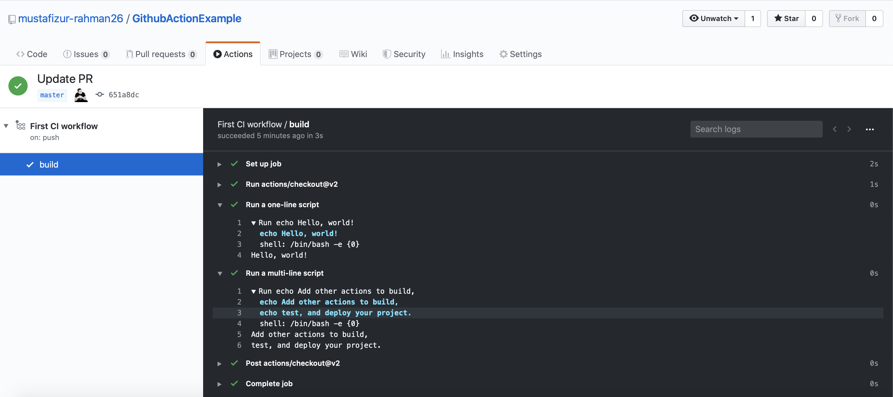

